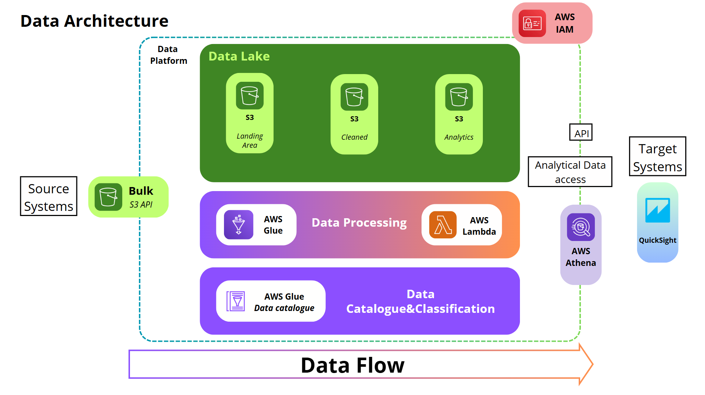

#  Data Engineering Project - YouTube Trending Analytics

> Projet inspiré du tutoriel complet de Darshil Parmar : [YouTube Tutorial](https://youtu.be/yZKJFKu49Dk)

##  Vue d'ensemble

Ce projet a pour objectif de construire un pipeline pour l’analyse des vidéos tendances sur YouTube. Il s'appuie sur des services AWS serverless pour collecter, transformer, stocker et analyser des données à grande échelle.

---
##  Objectifs du projet

1. **Ingestion** de données multi-sources
2. **Nettoyage & Transformation** des données brutes (ETL avec AWS Glue)
3. Stockage dans un **Data Lake centralisé (Amazon S3)**
4. **Scalabilité** et performances grâce aux services serverless
5. Hébergement **Cloud (AWS)** pour un traitement distribué
6. **Visualisation & Reporting** via Amazon QuickSight

---

##  Services AWS utilisés

| Service         | Rôle dans le projet                                  |
|-----------------|-------------------------------------------------------|
| **S3**          | Stockage brut (raw), cleansed et curated              |
| **Glue**        | Nettoyage, transformation, catalogage des données     |
| **Lambda**      | Déclenchement de l’ETL à l’arrivée de nouveaux fichiers |
| **Athena**      | Requêtes SQL sur le Data Lake                         |
| **QuickSight**  | Tableaux de bord interactifs                          |
| **IAM**         | Sécurité et contrôle d’accès                          |

---

##  Données utilisées

Dataset Kaggle sur les vidéos tendances de YouTube :

 [YouTube Trending Dataset](https://www.kaggle.com/datasets/datasnaek/youtube-new)

Ce jeu de données contient :
- Informations sur les vidéos : titre, catégorie, vues, likes, dislikes...
- Données par pays : `us`, `ca`, `gb`, etc.
- Un JSON complémentaire décrivant les catégories

---

##  Architecture du projet

---

##  Étapes techniques

1. Upload des fichiers dans des bucket **s3**
2. Déclenchement automatique via **AWS Lambda**
3. Traitement des données avec **AWS Glue Job (PySpark)** :
   - Mapping des types
   - Suppression des champs nuls
   - Partitionnement par région
   - Format **Parquet**
4. Stockage dans le bucket **cleaned**
5. Exploration via **Athena**
6. Visualisation via **QuickSight**
